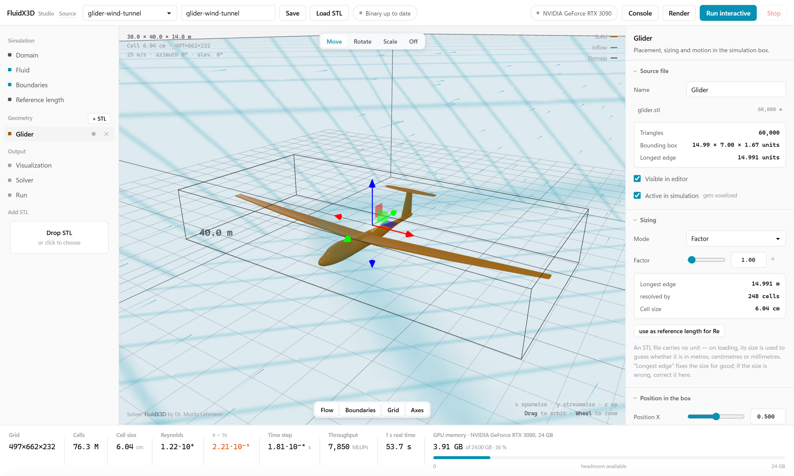
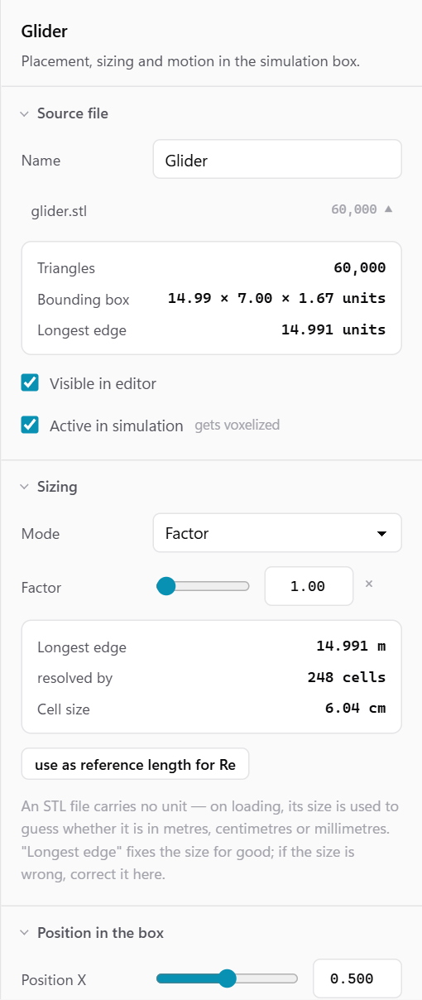
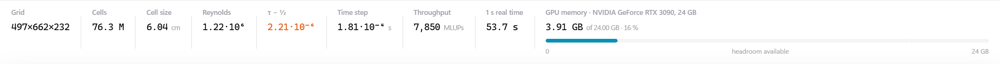
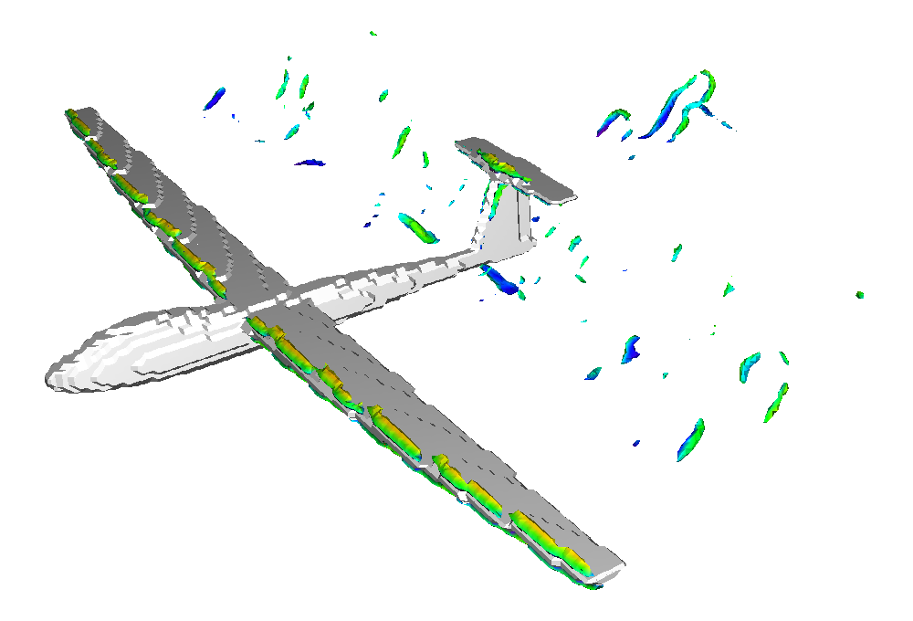

# FluidX3D Studio — web GUI for FluidX3D CFD simulations

FluidX3D Studio is a local web GUI for [FluidX3D](https://github.com/ProjectPhysX/FluidX3D), the fast lattice Boltzmann (LBM) CFD solver for GPUs by Dr. Moritz Lehmann. You set up a virtual wind tunnel in the browser: load an STL model, place and rotate it in the simulation box, set inflow speed, direction and boundary conditions. The studio then generates the FluidX3D configuration, compiles FluidX3D (OpenCL) only when a compile-time option has changed, and starts the simulation.



[](LICENSE)
[](https://nodejs.org/)
[](https://github.com/ProjectPhysX/FluidX3D)

Set up FluidX3D simulations without editing C++ or rebuilding for every variant.

> [!IMPORTANT]
> **Unofficial project.** FluidX3D Studio is not affiliated with or endorsed by FluidX3D or Dr. Moritz Lehmann. It is a wrapper: every simulation is computed by FluidX3D, which you download separately (as a git submodule) and which stays under its own license — no commercial and no military use. See [License](#license).

## Contents

- [Features](#features)
- [Screenshots](#screenshots)
- [Requirements](#requirements)
- [Quick start](#quick-start)
- [Configuration](#configuration)
- [What `install-solver` changes in FluidX3D](#what-install-solver-changes-in-fluidx3d)
- [How it works](#how-it-works)
- [Project structure](#project-structure)
- [Limitations](#limitations)
- [Testing](#testing)
- [Credits and acknowledgements](#credits-and-acknowledgements)
- [License](#license)

## Features

- **Scene setup in the browser.** A three.js viewport shows the simulation box, the boundary type of every face, a ground grid, axes and animated tracers that preview the inflow direction around your objects (a visual aid, not a simulation result).
- **STL geometry.** Upload binary STL files by button or drag and drop (up to 250 MB). Size an object by its longest edge in metres or by a scale factor, position it as a fraction of the box and rotate it by pitch, yaw and roll, with move/rotate/scale gizmos (`G`, `R`, `S`).
- **Flow and boundaries.** Inflow speed, azimuth and elevation, density, kinematic viscosity and lattice velocity `u_lbm`; each box face can be `equilibrium`, `open`, `solid` or `periodic`.
- **Rotating parts.** Objects can rotate about an axis at a given rpm (for example a propeller); FluidX3D re-voxelises them during the run (requires the `MOVING_BOUNDARIES` extension).
- **Thin-wall sealing.** Walls thinner than one cell vanish during FluidX3D's voxelisation. Optional sealing (shell or filled body, hole closing, minimum wall thickness) runs inside the solver at startup, on the grid of the actual run, so it always matches the current resolution.
- **Live instrument band.** Grid size, cell count, cell size, Reynolds number, τ with a stability warning, time step, estimated throughput (MLUPs), time per simulated second, and a VRAM meter against your GPU — computed with the same formulas the solver uses.
- **Solver options.** Velocity set (D3Q15/19/27), precision (FP32, FP16S, FP16C) and FluidX3D extensions (`SUBGRID`, `EQUILIBRIUM_BOUNDARIES`, `MOVING_BOUNDARIES`, `VOLUME_FORCE`, `FORCE_FIELD`, `SURFACE`, `TEMPERATURE`, `PARTICLES`), with checks for combinations that need each other.
- **Rebuild only when needed.** Setups are stored as JSON and read by FluidX3D at runtime. `defines.hpp` is generated from the setup; FluidX3D is recompiled only when a compile-time option actually changes. Everything else (geometry, flow, domain, boundaries) runs without a rebuild.
- **Interactive or render runs.** Start FluidX3D with its interactive window, or render a video frame sequence with an orbiting or fixed camera to `bin/export/<name>/`. Build and solver output stream live into a console in the GUI.
- **Reversible installation.** The FluidX3D checkout is only touched by an idempotent install script that backs up every file and can be undone completely.

## Screenshots

| Inspector | Instrument band |
|---|---|
|  |  |

What FluidX3D itself renders for the bundled example after 3 simulated seconds — 76 million cells, Q-criterion vortices coloured by velocity, a little over 2 minutes on a single RTX 3090:



## Requirements

- **Node.js 20** or newer, and **git**.
- **A GPU with OpenCL support** and current drivers — whatever FluidX3D itself needs (NVIDIA, AMD, Intel; see the [FluidX3D README](https://github.com/ProjectPhysX/FluidX3D)).
- **A C++ toolchain to build FluidX3D:**
  - Windows: Visual Studio 2019 or newer with the C++ workload (MSBuild is found on the `PATH` or through `vswhere`). FluidX3D's project file asks for the Visual Studio 2019 toolset; if that one is not installed, the studio builds with the newest installed toolset instead.
  - Linux/macOS: what FluidX3D's `make.sh` needs (g++ and the OpenCL headers/runtime).
- A current desktop browser.

The submodule is pinned to the FluidX3D version the studio is tested with: **FluidX3D v3.8** (commit [`9f3a995`](https://github.com/ProjectPhysX/FluidX3D/commit/9f3a995599740082690ace8cdc7a82b0396adddd)). Newer upstream versions usually work as well; `npm run install-solver` reports it if FluidX3D changed in a way it cannot handle.

## Quick start

```bash
# 1. clone including the FluidX3D submodule
git clone --recursive https://github.com/abgebaumt/fluidx3d-studio.git
cd fluidx3d-studio
# (already cloned without --recursive?  git submodule update --init)

# 2. install dependencies
npm install

# 3. install the solver-side files into ./fluidx3d
npm run install-solver

# 4. optional: skybox instead of a flat background colour in FluidX3D's visualisation
git -C fluidx3d apply --ignore-whitespace ../solver/patches/skybox-background.patch

# 5. start the studio
npm start
```

Open **http://127.0.0.1:8787**. The server listens on localhost only.

To try it right away, install the procedurally generated example glider (STL and a ready-made wind tunnel setup from `examples/`):

```bash
npm run example
```

Then (re)start the studio, pick `glider-wind-tunnel` from the setup drop-down in the header, check the numbers in the instrument band and press **Run interactive** or **Render**. The first run compiles FluidX3D, which can take a few minutes.

The skybox patch alters FluidX3D's source code (`src/kernel.cpp`, `src/lbm.cpp`, `src/lbm.hpp`). To undo it, run `git -C fluidx3d apply -R --ignore-whitespace ../solver/patches/skybox-background.patch`.

## Configuration

`studio.config.json` is created from `studio.config.example.json` on first start and is not tracked by git:

```json
{
  "fluidx3dPath": "./fluidx3d",
  "dataPath": "./data",
  "port": 8787,
  "gpu": { "name": "My GPU", "vramMB": 8192, "bandwidthGBs": 400 }
}
```

| Key | Meaning |
|---|---|
| `fluidx3dPath` | FluidX3D checkout, relative to the studio or absolute. Default: the submodule `./fluidx3d`. |
| `dataPath` | Optional. Where setups and uploaded STL files are stored (default `./data`), e.g. inside the repository of the project that uses the simulations. Backups of FluidX3D files always stay in `data/backup/`. |
| `port` | HTTP port; the environment variable `PORT` takes precedence. |
| `gpu` | Name, memory in MB and memory bandwidth in GB/s of your GPU. Used only for the VRAM meter and throughput estimate in the instrument band; it does not affect the simulation. |

If FluidX3D is not found, the server still starts: the editor stays usable, only building and running are disabled until the path is fixed.

## What `install-solver` changes in FluidX3D

Everything is idempotent and fully reversible with `npm run uninstall-solver`. Each file that gets touched is backed up once to `data/backup/<name>.orig`, and every edit in an existing FluidX3D file is enclosed in `fluidx3d-studio` marker comments so that uninstalling removes exactly those lines.

| File in `fluidx3d/` | Change |
|---|---|
| `src/json.hpp` | new — minimal read-only JSON parser |
| `src/mesh_seal.hpp` | new — thin-wall sealing at solver startup |
| `src/setup_config.cpp` | new — a `main_setup()` that builds the scene from the setup JSON, wrapped entirely in `#ifdef GUI_CONFIG_SETUP` |
| `src/setup.cpp` | the existing contents are wrapped in `#ifndef GUI_CONFIG_SETUP` … `#endif`, so your own setups are kept |
| `FluidX3D.vcxproj` | entries for the three new files (Windows only; `make.sh` compiles `src/*.cpp` by wildcard) |
| `src/defines.hpp` | not touched by the installer; overwritten by the server on each build, original saved as `data/backup/defines.hpp.orig` |

Without `GUI_CONFIG_SETUP` in `defines.hpp`, FluidX3D behaves exactly as before.

## How it works

1. **Setup.** The scene is saved as JSON (schema version 1) to `data/setups/<name>.json`. It fully describes one simulation: domain, fluid, boundaries, objects, visualisation, solver options and run mode.
2. **Build.** `defines.hpp` is generated from the solver options, visualisation constants and run mode. A hash over these compile-time options is compared with the last build; FluidX3D is recompiled only when it differs (MSBuild on Windows, `make.sh` elsewhere).
3. **Run.** The server starts `bin/FluidX3D --config <path to setup JSON>`. The generic `main_setup()` in `setup_config.cpp` reads the JSON at runtime: it computes the grid from box size and VRAM target, sets up units, loads, transforms and voxelises the STL objects, optionally seals them, sets boundaries and inflow and starts the interactive or render run.
4. **Feedback.** Console output and status values (time steps, MLUPs, simulated time) stream back to the GUI via server-sent events.

The interfaces between frontend, backend and solver are specified in [`CONTRACT.md`](CONTRACT.md); the original design notes are in [`docs/design.md`](docs/design.md). [`solver/README.md`](solver/README.md) describes the C++ side in detail.

## Project structure

```
fluidx3d-studio/
  fluidx3d/        git submodule: github.com/ProjectPhysX/FluidX3D (not part of this repo)
  server/          Node.js backend (Express): API, build, run, defines.hpp generation
  web/             frontend: plain ES modules and three.js, no bundler
  solver/          C++ files installed into FluidX3D, optional patches
  scripts/         install-solver.js, uninstall-solver.js, example installer
  examples/        procedurally generated example glider and setup
  test/            tests (node:test)
  docs/            design notes and screenshots
  data/            runtime data: uploads, setups, backups (not tracked)
  CONTRACT.md      binding interfaces between all parts
```

## Limitations

- Geometry is STL only; FluidX3D's built-in primitive shapes are not available in the GUI yet. The solver reads binary STL only — ASCII STL files can be uploaded and previewed, but have to be converted to binary before they can be simulated.
- Camera paths for render runs are limited to orbit and fixed camera.
- One run at a time.
- Multi-GPU setups are not configured from the GUI; FluidX3D's device IDs on the command line still apply.
- Sealing is skipped for rotating objects, since they are re-voxelised during the run.
- Tested on Windows with MSBuild. Building on Linux/macOS via `make.sh` is supported but less tested.

## Testing

```bash
npm test
```

Runs the backend tests with Node's built-in test runner: derived quantities against hand-calculated values, the HTTP API end to end (in a temporary sandbox, without GPU or compiler), `defines.hpp` generation and the rebuild decision, and the sealing reference implementation. See [`test/README.md`](test/README.md).

## Credits and acknowledgements

**FluidX3D** is written by **[Dr. Moritz Lehmann](https://github.com/ProjectPhysX)** — <https://github.com/ProjectPhysX/FluidX3D>. All of the physics, the GPU kernels, the voxelisation and the real-time rendering you see when a simulation runs are his work. FluidX3D makes billion-cell CFD possible on a single consumer graphics card, is free for research, education and personal use, and comes with remarkably thorough documentation. This studio would not exist without it. Thank you, Moritz, for building FluidX3D and for sharing it so openly.

If you publish scientific work that uses FluidX3D, please cite the articles listed in the [FluidX3D references](https://github.com/ProjectPhysX/FluidX3D#references) — the FluidX3D license asks for that.

FluidX3D Studio is also built on:

- [three.js](https://threejs.org/) — 3D viewport (MIT)
- [Express](https://expressjs.com/) — HTTP server (MIT)
- [multer](https://github.com/expressjs/multer) — file uploads (MIT)

## License

FluidX3D Studio combines code under two different licenses. The details are in [`NOTICE.md`](NOTICE.md).

**The studio's own code** is licensed under the [GNU Affero General Public License v3.0 or later](LICENSE) (AGPL-3.0-or-later), Copyright © 2026 Tim Stuhler. It carries an additional permission under AGPL section 7 that allows linking and combining it with FluidX3D (see `NOTICE.md`).

**FluidX3D** (the submodule `fluidx3d/`) and the two files derived from it in this repository — `server/defines.template.hpp` and `solver/patches/*.patch` — are under the [FluidX3D license](LICENSES/FluidX3D.md) by Dr. Moritz Lehmann, not under the AGPL. The name "FluidX3D" is protected.

What this means in practice (a summary, not legal advice — the license texts apply):

- **Using the studio privately** does not oblige you to anything under the AGPL.
- **If you distribute a modified version** of the studio, or **let other people use a modified version over a network**, you must make its complete source code available to them under the AGPL.
- **FluidX3D's terms apply to every use of the studio with the solver**, because every binary the studio builds contains FluidX3D: public research, education and personal use only — **no commercial use and no military use**. The AGPL does not lift these restrictions.
- The FluidX3D built by the studio is an altered version (the installer adds files; the optional patch changes kernels). If you publish binaries or results made with an altered version, the FluidX3D license requires its altered source code to be published. The studio's own changes already are — they are this repository. Any further changes you make yourself have to be published as well.
